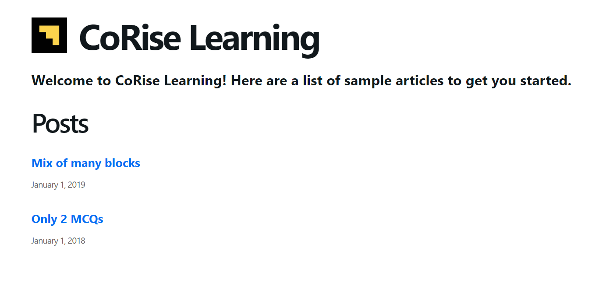
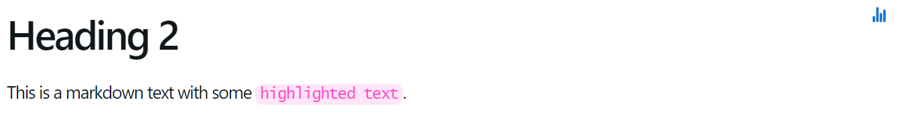
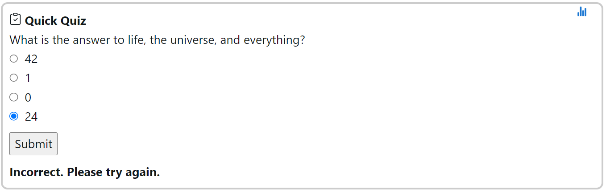
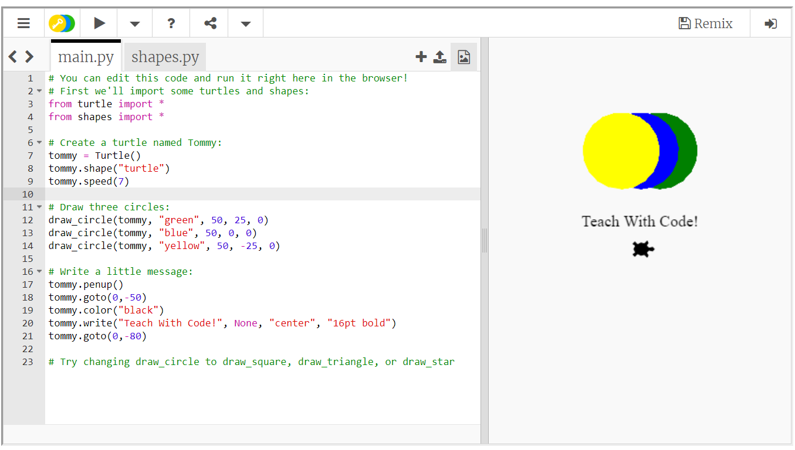
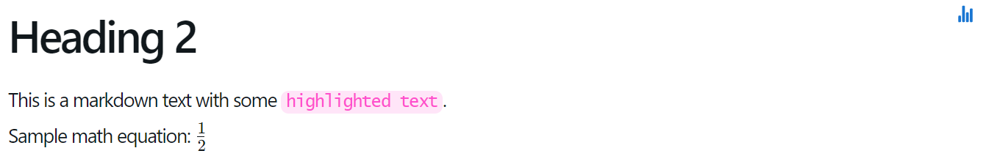
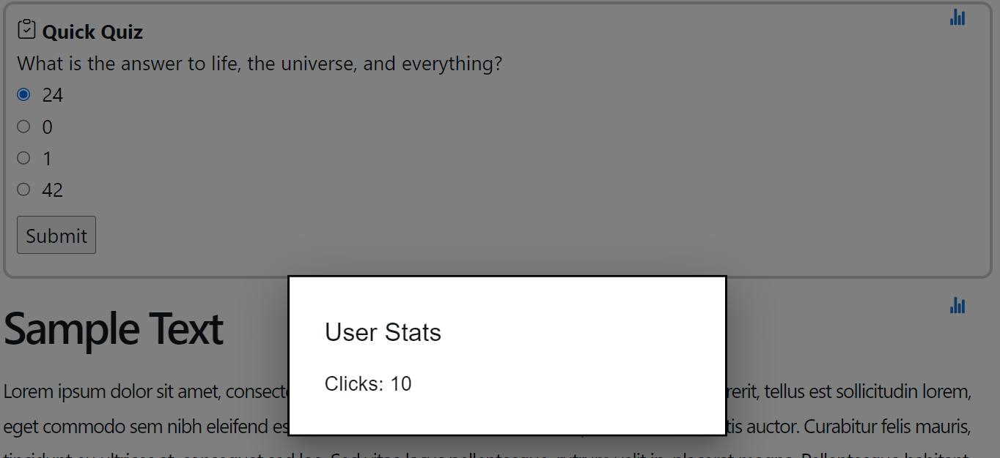
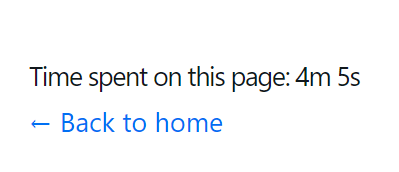

# CoRise-learning-articles

This is an interactive articles collection made for CoRise. It is built with Next.js and React.js.

## Getting Started

First, run the development server:

```bash
npm run dev
# or
yarn dev
# or
pnpm dev
```

Open [http://localhost:3000](http://localhost:3000) with your browser to see the result.

## Front Page

The front page is located at `pages/index.js`. It is a simple page that lists all the articles in the `posts` directory. The articles are sorted by date in descending order.



## Features

This project uses the original Multiple Choice Question block, the Markdown block and the Sandbox block to create an interactive article. The Markdown block currently supports standard markdown syntax and math formulas to be rendered with [KaTeX](https://katex.org/).

## How to create an article

To start, you need to create a folder under `posts` directory. The folder name will be the article's slug. For example, if you create a folder named `hello-world`, the article's url will be `http://localhost:3000/posts/hello-world`. 

In the folder, you would need to create a JSON file with the following fields:
- `title`: The article's title
- `date`: The article's date
- `blocks`: A list of blocks that will be rendered

Then, you can create a block by creating a JSON file under the subdirectory `/data` inside your article's folder.

Each block has the following fields:
- `Type`: The block's type. Currently, there are two types: `Markdown` and `MCQ` for multiple choice question
- `Object`: The content of the block

Example Markdown block:
```
{
   "Type": "Markdown",
   "Object": {
       "Text": "## Heading 2\nThis is a markdown text with some `highlighted text`."
   }
}
```
Rendered Markdown block:


Example MCQ block:
```
{
   "Type": "MCQ",
   "Object": {
       "Question": "What is the answer to life, the universe, and everything?",
       "CorrectOption": 42,
       "IncorrectOptions": [
           "24",
           "0",
           "1"
       ],
       "FeedbackOnIncorrect": "Incorrect. Please try again."
   }
}
```
Rendered MCQ block:


## Additional features

### Sandbox block
In addition to the two original blocks, I implemented a new Sandbox block, which allows the webpage to include an interactive embedded Python sandbox. The sandbox is created with [Trinket](https://trinket.io/), and to create a Sandbox block, all you need is to upload your code to Trinket and copy the embed url to the `url` field of the block.

Example Sandbox block:
```
{
    "Type": "Sandbox",
    "Object": {
        "url": "https://trinket.io/embed/python/3d8d7ce66b"
    }
}
```
Rendered Sandbox block:


### Math formulas
In the markdown block, you can use math formulas with [KaTeX](https://katex.org/). For example, you can write `$\frac{1}{2}$` to render a fraction.

Result:


### User Stats
As you can see in the sample code blocks, there is a `Stats` button on the top right of each block. This button will show the user's stats for the block. The stats include the number of clicks that the user has made. 

Example:


At the bottom of each article, there is a line of text where it describes the time that the user has spent on the article. The time is calculated by the current time minus the time when the user first opened the article. The time will be updated every second.

Example:



## Design decisions

### Why Next.js?
I chose Next.js because it is a React framework that is easy to use and has a lot of features. It is also very easy to deploy. I have used Next.js in the past and I am familiar with it.

I chose Next.js because it is a very popular full-stack framework that is easy to use and has a lot of features. It is also very easy to deploy. I have yet worked with it in the past, but I feel that I should use this opportunity to learn more about it so that I can fully utilize it whether professionally or personally in the future.

Unfortunately, it was a bit harder to approach that I original thought because of the complicated relationship between Next.js and React.js due to server-side rendering. I had to learn a lot of new things in order to get started. However, I think it was worth it because I learned a lot of new things about SSR and Next.js.


### Why Trinket?
I chose Trinket because it is a very straight forward embedded online sandbox. I also considered using CodeMirror, but I really wanted to implement an interactive sandbox that you can compile code as I always wanted educational websites to be able to render code on the spot, but none of them has implemented such a feature.

### Backend Design
I separated the workflow into 3 steps:
- Post fetching: Fetching all the posts from the `posts` directory, and getting all the settings for each post to pass it onto the next step.
- Block fetching: fetching all the blocks for each post, and converting the data from JSON to the corresponding types (MCQ, Markdown, Sandbox).
- Preprocessing: for certain blocks, preprocessing would need to be done on the data before sending it to the front end, and this step is executed in the `parser.tsx` file in `lib`, where, depending on the type of block, the data would be processed accordingly. For example, for the Markdown block, the markdown string would need to be converted to HTML string using `Remark` and the MCQ choices would need to include the correct answer in the choices, as I found out that shuffling the choices in the front end would cause a disconnect between the data sent and the data rendered.
- Rendering: when the frontend receives the data, it will be transformed into React components and rendered on the page. For each different type, there is a corresponding component that will render the datam i.e. in `mcq.tsx`, the data is transformed into a `MCQ` card component.

Also, I chose to use the dynamic routing feature of Next.js to create a page for each article as I don't have to worry about extracting the slugs from the `posts` directory and generate the routes manually, and it would also be easier to add new articles in the future.

For the block data, I chose to add a `settings.json` file in each article's folder as simply storing the blocks wouldn't contain enough information for each article, and this method can also allow expansion of the article's settings in the future.

### Frontend Design
I chose to implement a very simplistic view of the article because when I went through other articles website, I found that the simpler ones retained my attention and allowed me to focus on the content instead of the design. 

As for the blocks, I implemented them as close as possible to the original mocks, and I also added some variations to make it more appealing.